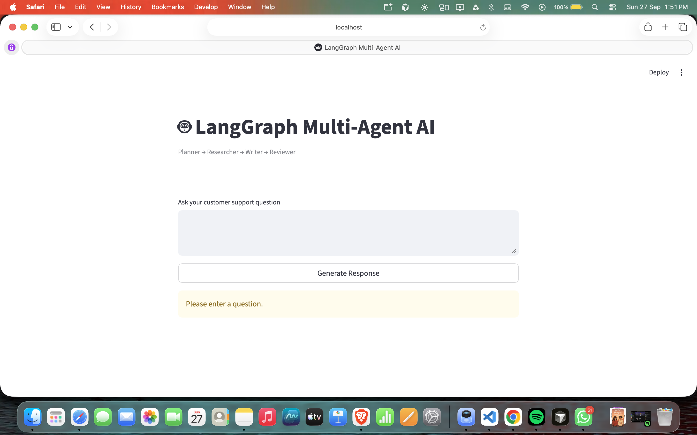
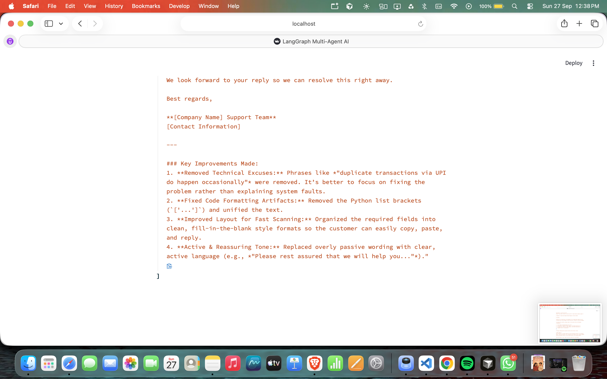

# 🤖 LangGraph Multi-Agent Customer Support AI

A multi-agent AI application built using **LangGraph, LangChain, Gemini, and Streamlit** that generates professional customer support responses through a collaborative workflow of specialized AI agents.

## 🚀 Features

- 🧠 Planner Agent – Understands the customer's intent
- 🔍 Researcher Agent – Identifies required information
- ✍️ Writer Agent – Drafts a professional response
- ✅ Reviewer Agent – Improves grammar, clarity, and tone
- 🌐 Interactive Streamlit web interface
- 🤖 Powered by Google Gemini API

## 🛠️ Tech Stack

- Python
- LangGraph
- LangChain
- Google Gemini
- Streamlit

## 🏗️ Multi-Agent Architecture

User Query
↓
Planner Agent
↓
Researcher Agent
↓
Writer Agent
↓
Reviewer Agent
↓
Final Response

## 📸 Project Screenshots

### Home Interface



### Multi-Agent Workflow



### Final AI Response


### Reviewer Improvements


## 📂 Project Structure

langgraph-multi-agent/
├── agents.py
├── graph.py
├── state.py
├── app.py
├── requirements.txt
├── screenshots/
└── README.md

## ⚙️ Installation

```bash
git clone https://github.com/Anjali1845/langgraph-multi-agent.git
cd langgraph-multi-agent

python -m venv .venv
source .venv/bin/activate

pip install -r requirements.txt
```

Create a `.env` file:

```env
GOOGLE_API_KEY=your_api_key_here
```

Run the application:

```bash
streamlit run app.py
```

## 👩‍💻 Author

**Moka Anjali**

B.Tech CSE (AI & ML)